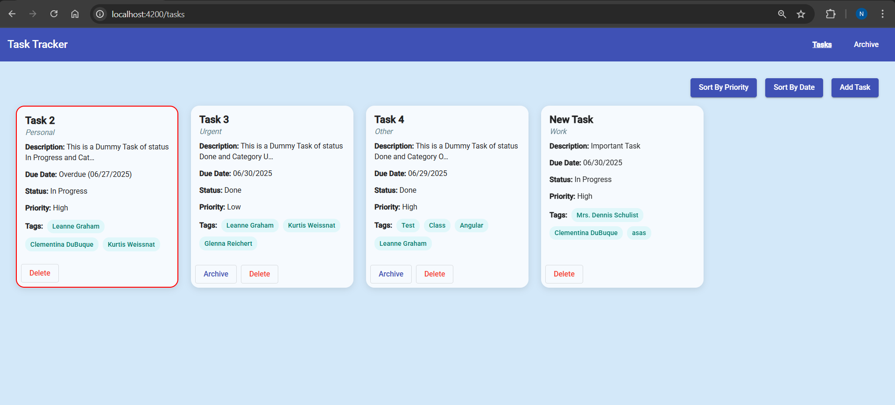
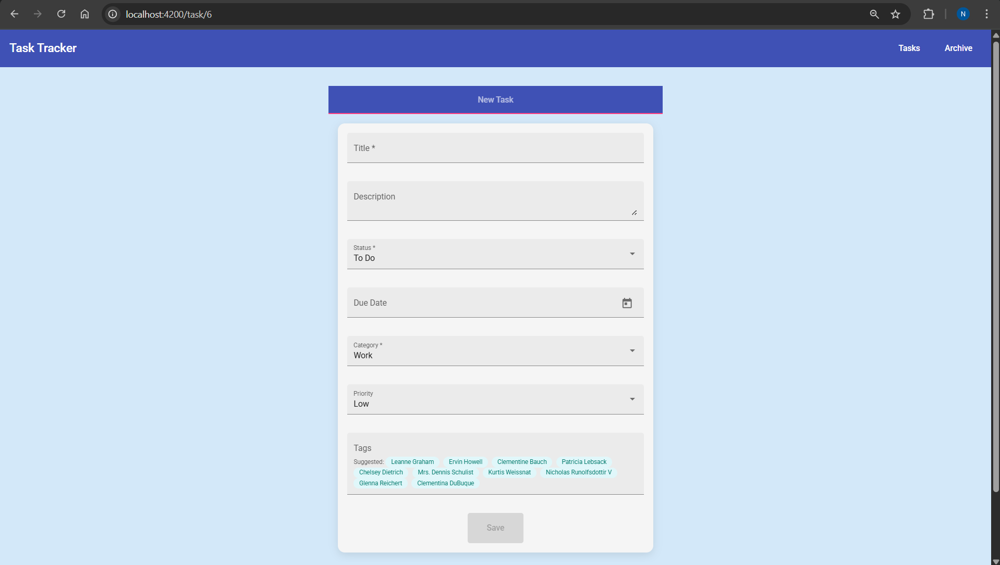
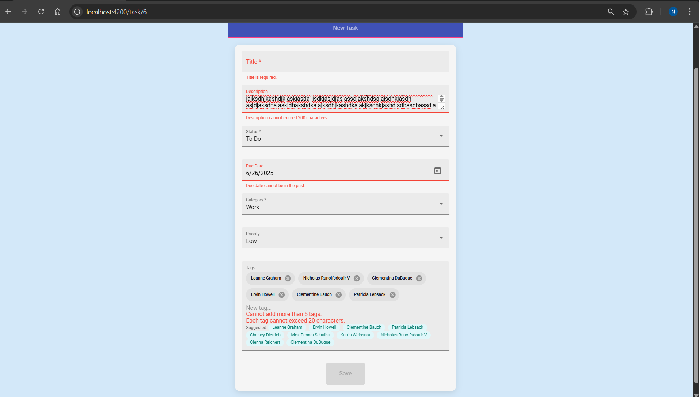
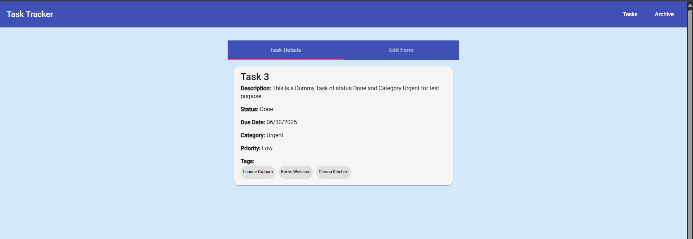
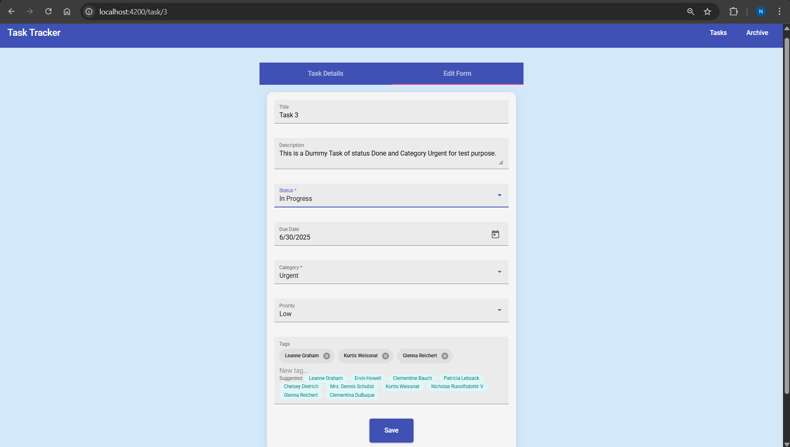
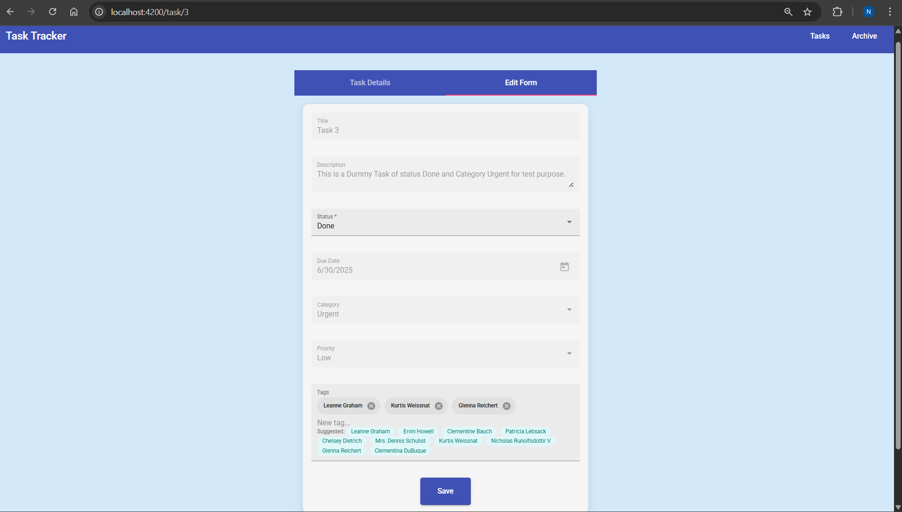
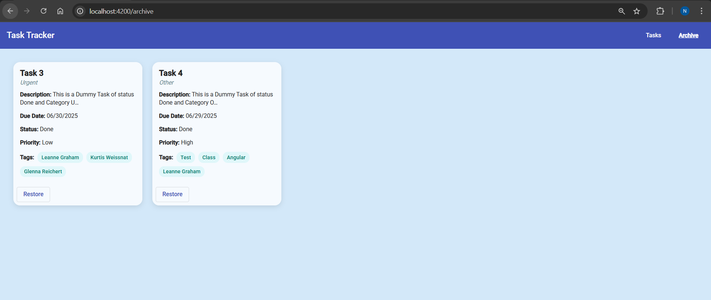

# TaskTracker

This project was generated with [Angular CLI](https://github.com/angular/angular-cli) version 13.3.11.

## Development server

Run `ng serve` for a dev server. Navigate to `http://localhost:4200/`. The application will automatically reload if you change any of the source files.

## Tasks Route

By Default the page will route to /tasks route, where we can see list of tasks as a Angular Material Cards with appropriate pipes applied in UI. We can also find three buttons in top right corner, Sort By Priority, Sort By Date will sort of tasks displayed in UI without updating the order of tasks stored in Local Storage and in Task Service. Add Task Button will redirect to /task/:id route will a new task id. appOverdueHighlight Directive is applied on each Task Card to add a red border on task with past due date.



## Task Details Route

We have two view corresponding to the type of task we are dealing with.

if we are adding a new task by clicking Add Task button in UI, we will show a form to collect information about the task will appropriate error messages shown in UI.

The Default Form will look as follows


The Form will validation errors will look as follows


When Save button is clicked we will be redirected to Task List Route

We can vist Task Detail Component by clicking the card element in Task List Route, then we will see a different UI with Material Tab Group to show the Task Details in the first tab and edit the task details in second tab.

The first tab to view the Task Details will look as follows


The Second tab to edit the Task Details will look as follows


When the status is Done then all form controls will be disabled by default and when the status is changed every form element will be enabled and will not get disabled again to allows users to change all form elements without any constraint.


## Archive Route

We can change the Archive status of a Task By clicked Archive button in Task List Route and we can change it back by clicking Restore button in Archive Route.



## Project Structure in SRC Folder

<pre> ``` src
├── app
│   ├── app-routing.module.ts
│   ├── app.component.html
│   ├── app.component.scss
│   ├── app.component.spec.ts
│   ├── app.component.ts
│   ├── app.module.ts
│   ├── components
│   │   ├── archive
│   │   │   ├── archive.component.html
│   │   │   ├── archive.component.scss
│   │   │   ├── archive.component.spec.ts
│   │   │   └── archive.component.ts
│   │   ├── task-card
│   │   │   ├── task-card.component.html
│   │   │   ├── task-card.component.scss
│   │   │   ├── task-card.component.spec.ts
│   │   │   └── task-card.component.ts
│   │   ├── task-detail
│   │   │   ├── task-detail.component.html
│   │   │   ├── task-detail.component.scss
│   │   │   ├── task-detail.component.spec.ts
│   │   │   └── task-detail.component.ts
│   │   └── task-list
│   │       ├── task-list.component.html
│   │       ├── task-list.component.scss
│   │       ├── task-list.component.spec.ts
│   │       └── task-list.component.ts
│   ├── directives
│   │   ├── disable-completed.directive.spec.ts
│   │   ├── disable-completed.directive.ts
│   │   ├── overdue-highlight.directive.spec.ts
│   │   └── overdue-highlight.directive.ts
│   ├── models
│   │   ├── enums.ts
│   │   └── task.ts
│   ├── pipes
│   │   ├── due-date-format.pipe.spec.ts
│   │   ├── due-date-format.pipe.ts
│   │   ├── truncate.pipe.spec.ts
│   │   └── truncate.pipe.ts
│   └── services
│       ├── task.service.spec.ts
│       └── task.service.ts
├── assets
├── environments
│   ├── environment.prod.ts
│   └── environment.ts
├── favicon.ico
├── index.html
├── main.ts
├── polyfills.ts
├── styles.scss
└── test.ts
``` </pre>